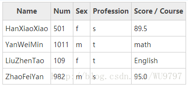

# c语言学习

## 字符串

#### <a href="./string/huiwen.c">demo1</a>
如果参数字符串是个回文，函数就返回真，否则返回假。回文就是指一个字符串从左向右和从右向左读是一样的。函数应该忽略所有的非字母字符，而且在进行字符比较时不用区分大小写

#### <a href="./string/quchong.c">demo2</a>
去除掉字符串中重复的字符

#### <a href="./string/decr_encry.c">demo3</a>
按照指定的key对字符串进行简单的加密和解密(不可用于生产)

## 结构体与联合
#### <a href="./struct/table.c">demo1</a>
将用户输入的学生信息打印成表格，输出的形式如下： 

 

当某人为的职业为学生s时，score/course项要为score；当某人为的职业为教师t时，score/course项要为cour

## 单向链表

#### <a href="./singlelink/single.c">demo1</a>
向单向有序递增链表,中插入节点,插入新节点后的链表依然保持递增有序

## 双向链表

#### <a href="./doublelink/doublelink.c">demo1</a>
实现了双向链表的增删改查

## 指向函数的指针

#### <a href="./funcpoint/findnode.c">demo1</a>
通过回掉函数的方式去确认指定的值是否在相关的集合之中,对外统一使用search_node方法, 而回掉函数负责具体的寻找实现

## I/O 操作
#### <a href="./io/copy_file.c">demo1</a>
在命令行中指定目标文件名 和 原标文件名,进行文件的拷贝, 例如: ./a.out new_file_name old_file_name 

#### <a href="./io/component/main.c">demo2</a>
实现了模块化开发，以双向链表的形式实现了节点的增、删、改、查,并将数据存储到文件中;
